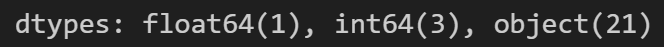
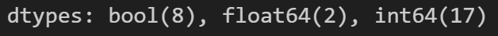
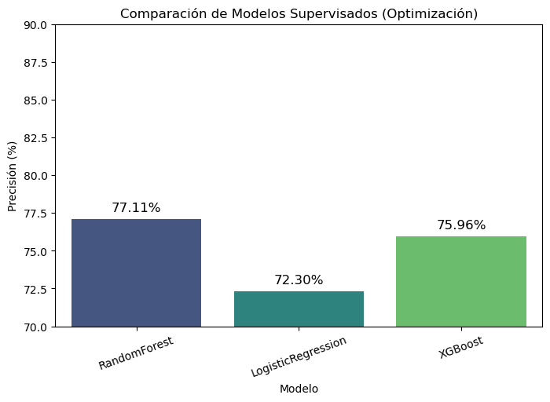
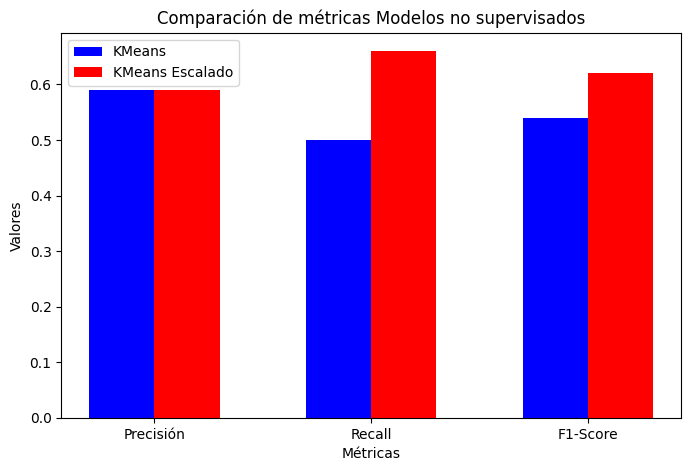

# RememberUs

El Alzheimer es un tipo de enfermedad mental neurodegenerativa que como primer paso afecta la memoria y el pensamiento lógico. El objetivo principal de este proyecto es entrenar diferentes modelos de IA para predecir el desarrollo de Alzheimer en una persona. Ademas combinamos los modelos predictivos con un chatbot basdo en el el LLM [DeepSeek R1 Zero](https://openrouter.ai/deepseek/deepseek-r1-zero:free) para que cualquier persona pueda probar de primera mano el funcionamineto de los modelos de prediccion. [Prueba Aquí!!!](https://huggingface.co/[placeholder])

## Tabla de contenidos

1. [Arquitectura](#Arquitectura)
2. [Proceso](#Proceso)
3. [Funcionalidades](#Funcionalidades)
4. [Estado del proyecto](#EstadoDelProyecto)
5. [Agradecimientos](#Agradecimientos)

## Arquitectura 

Tanto el codigo de el procesamiento de datos y la creación de los modelos predictivos, está montado en un kernel Python en un Jupiter Notebook, haciendo uso de librerias como:

- Numpy
- Pandas
- Matplotlib
- Seaborn
- scikit-learn
- XGBoost
- Keras 
- Tensorflow
- ?

Y para el acceso remoto a este proyecto, utilizamos este repositorio en GitHub

## Proceso de desarrollo

# Procesamiento del dataset orginial

Empezamos con el procesamiento de un dataset con datos de personas que padecen Alzheimer y otras que no, obtenido de [Fuente del dataset](https://www.kaggle.com/datasets/ankushpanday1/alzheimers-prediction-dataset-global).

Para empezar el dataset original cuenta con los siguientes tipos de columnas

Originalmente solo se cuenta con 4 columnas numéricas de 25 columnas, las columnas no numéricas fueron convertidas a categorícas numéricas, además se hace una normlalización de los datos.

Luego del procesamiento de los datos, se tienen solo columnas numéricas, con un total de 27 columnas.

Entonces en este momento se realiza un analísis exploratorio de los datos, donde veremos la correlación entre columnas, por lo que se puede ver en el mapa de correlación, hay realmente pocas categorias que se relacionen con otras, siendo "Age" y "Alzheimer's diagnosis" la mayor correlación en todo el dataset, lo que no es una buena ni novedosa noticia.

# Resultado de los modelos

Los modelos supervisados entrenados fueron:
- RandomForestCLassifier (scikit-learn) (n_estimators=1200, max_depth=40, min_samples_split=2, random_state=42)
- LogisticRegresion (scikit-learn) (max_iter=2500, C=4.0, solver="liblinear", random_state=42)
- XGBClassifier (XGBoost) (n_estimators=600, learning_rate=0.05, max_depth=15, subsample=0.9, colsample_bytree=0.9, eval_metric="logloss", random_state=42)

Los modelos no supervisados entrenados fueron:
- Kmeans (scikit-learn)(n_clusters=2, algorithm='lloyd', init='random', max_iter=100, n_init=10, random_state=1)
- kmeans(con MinMaxScaler) (n_clusters=2, algorithm='lloyd', init='random', max_iter=100, n_init=10, random_state=1)